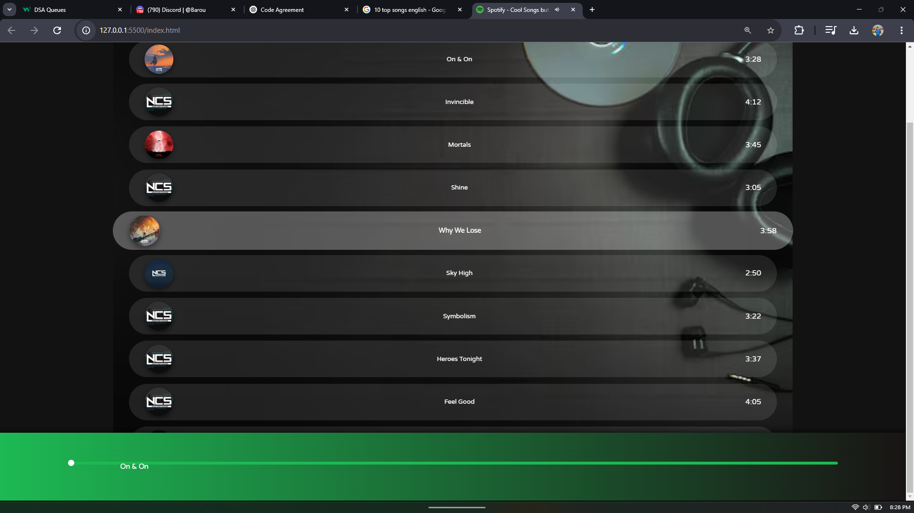

# 🎵 Spotify Clone 🎵  

A simple Spotify web clone built using HTML, CSS, and JavaScript. This project allows users to play songs with a basic UI similar to Spotify.  

## 🚀 Features  
✔️ Play & Pause songs  
✔️ Display current song name and progress bar  
✔️ Auto-play next song  
✔️ Beautiful and responsive design  

## 🛠️ Technologies Used  
- HTML  
- CSS  
- JavaScript  

## 📷 Screenshot  

## 🔧 How to Run  
1. Download or clone this repository.  
2. Open **index.html** in your browser.  

## 📜 License  
This project is for educational purposes only and does not use Spotify's official API.  

---
Made with ❤️ by [Your Name]
